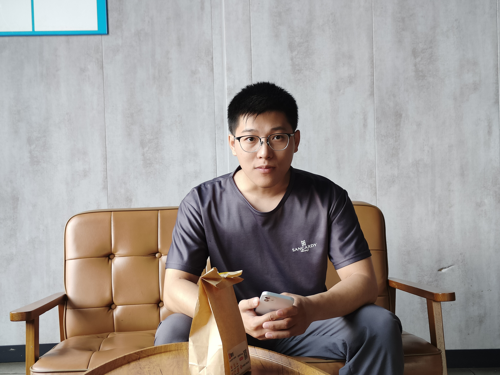

# 欢迎来到我的网站

## 开发者介绍

- **普通人民群众：** 欧星星
- **寄语：** 我会持续不断更新内容，如果对你有帮助，你可以收藏此网页和给我提供建议；如果存在侵害你权益的地方，请及时联系我删除。
- **联系邮箱：** ota1754@qq.com

## 网站建立

本站基于 vitepress 搭建，你可以使用云服务器或者 GitHub Pages 等方式来部署。

- 基于官方项目的默认设置，我主要做出了一下功能的修改：
  - 1、仅保留中文的文档，其他语言的文档不保留。
  - 2、简化了部分官方的样式，使其更加适合我的个人使用。
  - 3、使用自动生成侧边栏插件，简化了侧边栏手动的配置的过程。
  - 4、官方项目中图片不可单独点击随意放大，我使用了图片查看增强插件，图片可以自定义随意放大。

## 建站目的

### **1、知识沉淀与分享**

- 记录学习过程，整理和梳理自己的思路，加深自己对知识点的理解。
- 未来遇到类似问题时，可以快速查阅自己写的文章，提高效率。
- 分享自己作品。

### 2、提升表达能力

- 学会如何清晰地表达和解释自己的思路。
- 训练自己用简洁明了的方式表达技术概念。

### 3、**记录项目经验，避免重复踩坑**

- 整理并记录自己解决过的知识问题、踩过的坑、用过的工具、优化过的代码，分享出去帮助自己和他人。
- 下次遇到类似问题时，可以在任何设备和地方通过网页快速回顾解决方案。

### 4、帮助他人

- 可以帮助跟我一样有相同问题的朋友，让他们少走弯路。

- 希望结识跟我兴趣领域一样的朋友，交流经验，找到志同道合的朋友，共同进步。

- 待我后续整理好项目，我会把此项目源码免费无偿开源分享到 GitHub，你可以使用代码建立一个属于你自己的网站，知识因为有你和我才能传递！
