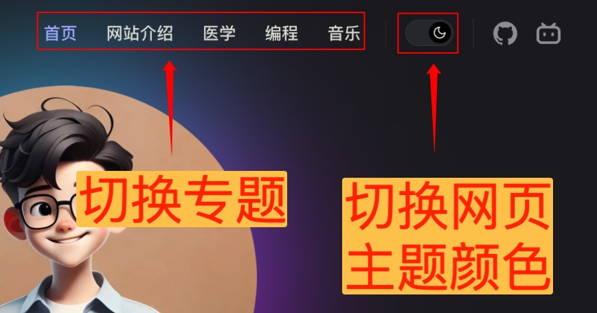
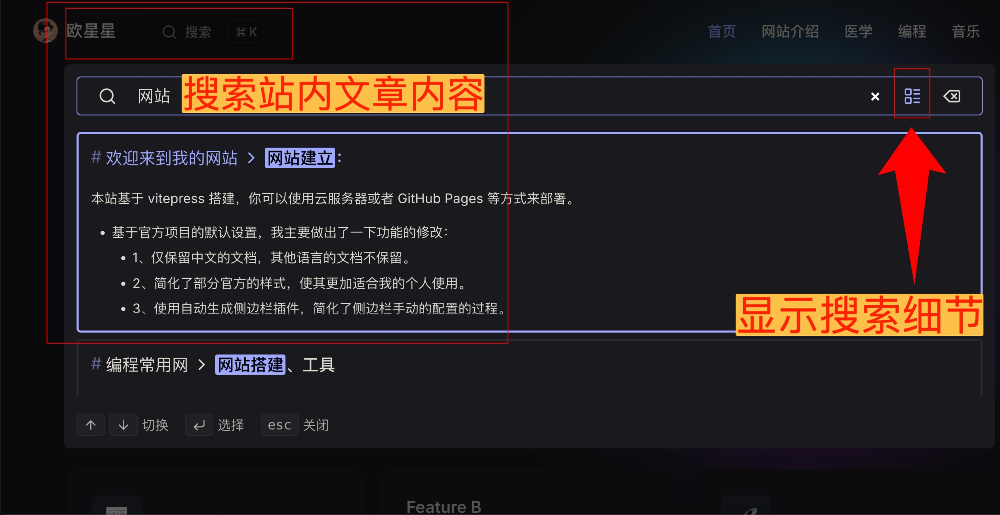
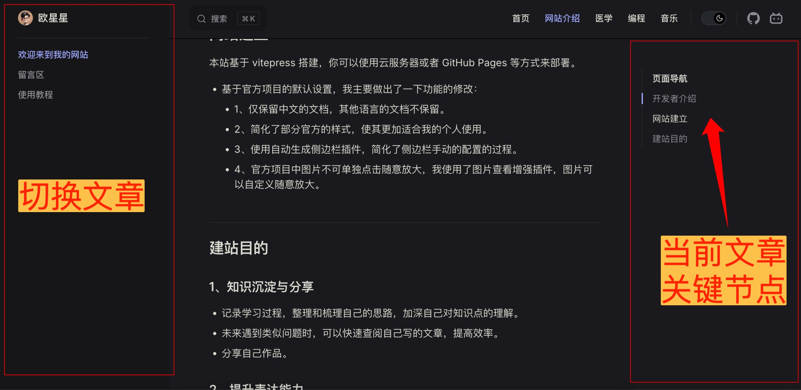
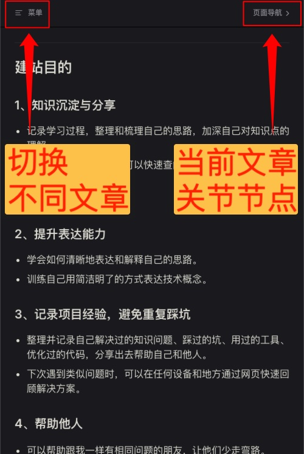

# 使用教程

1.[电脑 pc 端](#pc)

2.[手机、移动设备](#phone)
::: danger 注意
如果使用手机微信，强烈建议复制地址后用浏览器打开此网站，否则部分页面、视频、图片无法正常显示。
:::

## 电脑 pc 端 

1.

2.

3.

## 手机、移动设备 

::: danger 注意，再次强调
如果使用手机微信，强烈建议复制地址后用浏览器打开此网站，否则部分页面、视频、图片无法正常显示。
:::

1.

2.
