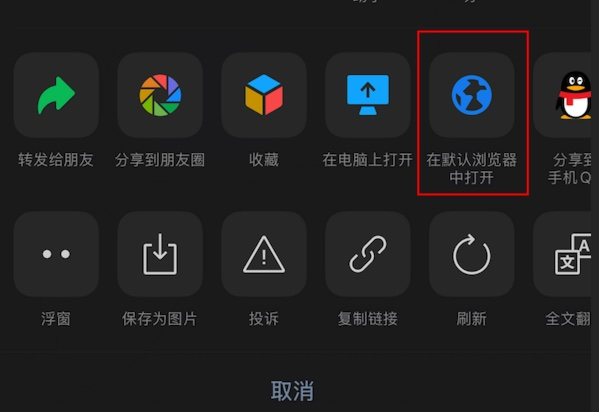

# 使用教程

1.[电脑 pc 端](#pc)
::: tip 建议
建议使用谷歌 chrome 浏览器打开此网站
:::

2.[手机、移动设备](#phone)
::: danger 注意
如果使用手机微信，强烈建议复制地址后用浏览器（推荐使用谷歌 chrome 浏览器），或跳转到手机浏览器打开此网站，否则部分页面空白、视频、图片无法正常加载显示。
:::

## 电脑 pc 端 

1.

2.

3.

4.

## 手机、移动设备 

::: danger 注意，再次强调
如果使用手机微信，强烈建议复制地址后用浏览器（推荐使用谷歌 chrome 浏览器），或跳转到手机浏览器打开此网站，否则部分页面空白、视频、图片无法正常加载显示。
:::

1.

2.

3.

### 手机使用浏览器打开

- 

- 
