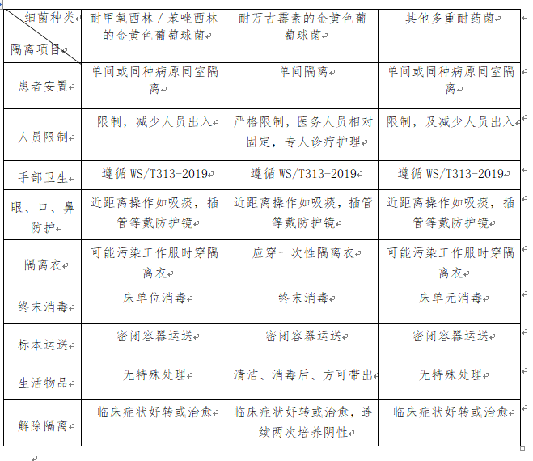

# 【岗前培训】新员工必掌握的院感知识

## 一、医院感染管理工作的重要性

**重大医院感染管理不良事件屡屡发生：**

- 妇儿医院手术切口分枝杆菌感染暴发

- 宿州眼球事件省中 HIV 感染事件

- 顺德新生儿感染

- 东台医院血透至 69 例患者感染丙肝……

### 医院感染——全球性挑战(Healthcare-associated infections, HAIs)

- 每年，全世界数百万患者在接受 疾病治疗的同时发生感染

- HAI 已成为巨大社会负担和重要 的患者安全问题

- 不断发生的感染暴发和严重感染 事件给我们敲响了警钟尽管 HAIs 不能完全消除，但却是高度可预防的

### 临床医务人员是医院感染管理核心主体与主战部队

- 每一位员工必须按照规范进行操作，高度保持感染防控意识，才能真正降低感染风险。
- **规范执行院感防控，既是保护患者，也是保护自己，可以在发生医疗纠纷时有效规避法律责任（重要）。**
- 需要重新审规我们每一个员工进行的操作是否有规范的操作规程，是否存在感染风险与医疗风险，需要不断改进不 断完善。
- 我们的操作是否真正落实我们发现了风险点是否及时报告与改进切实按照医院流程进行传染病的筛查。

### 医院感染防控涉及面广

- 患者、工作人员、探视者、 学生、进修人员、来访者、 志愿者等
- 各临床科室、实验室
- 医务部、护理部、 客户服务中心等
- 消毒供应部门
- 后勤管理部门（基建、后勤、饮食）外包服务管理（保洁、 被服、施工等）
- 临床医学工程部（消 毒设施、防护装备等）

### 人人都是最佳感控实践者

- 预防为先：手卫生、无菌操作、安全器械
- 规范行为：制度执行、行为准则
- 及时诊断：及时发现、及时上报
- 措施有力：进行有效的隔离、消毒、防护
- 有效治疗：有效措施、合理使用药物
- 杜绝流行：患者安全、员工安全
- **标准预防最重要**

## 二、医院感染诊断标准

### 1、医院感染定义：

医院感染(Nosocomial Infection, Hospital Infection 或 Hospital acquired Infection)是指住院病人在医院内获得的感染，包括在住院期间发生的感染和在医院内获得出院后发生的感染；但不包括入院前已开始或入院时已存在的感染。医院工作人员在医院内获得的感染也属医院感染。

### 2、医院感染诊断原则

具体各部位的诊断标准详见：[《医院感染诊断标准(试行)》 卫医发[2001]2 号](./3.医院感染诊断标准)

#### **下列情况属于医院感染**

- 1．无明确潜伏期的感染，规定入院 48 小时后发生的感染为医院感染；有明确潜伏期的感染，自入院时起超过平均潜伏期后发生的感染为医院感染。
- 2.本次感染直接与上次住院有关。
- 3.在原有感染基础上出现其它部位新的感染(除外脓毒血症迁徙灶)，或在原感染已知病原体基础上又分离出新的病原体(排除污染和原来的混合感染)的感染。
- 4.新生儿在分娩过程中和产后获得的感染。
- 5.由于诊疗措施激活的潜在性感染，如疱疹病毒、结核杆菌等的感染。
- 6.医务人员在医院工作期间获得的感染。
- **注意：** 痰、尿(上导尿管者)、烧伤创面可以存有多种细菌，因此段时间连续几天几次的培养有不同细菌生长只算 1 次感染。

#### **下列情况不属于医院感染**

- 1.皮肤粘膜开放性伤口只有细菌定植而无炎症表现。

  - （注意：培养出微生物不一定是切口感染。还需要有脓细胞存在，以防培养出的细菌为正常菌群，而不是伤口感染的病原菌。（除 I 类切口外））

- 2.由于创伤或非生物性因子刺激而产生的炎症表现。

- 3.新生儿经胎盘获得(出生后 48 小时内发病)的感染，如单纯疱疹、弓形体病、 水痘等。

- 4.患者原有的慢性感染在医院内急性发作。

- 5.邻近部位感染的自然扩散不列入医院感染统计，如肺部感染所致脓胸； 上呼吸道细菌引起下呼吸道感染。

- 6.新生儿感染:
  - ① 诊断吸入性肺炎必须对吸入物的性质、吸入后自然吸收情况及是否发生感染性肺炎进行分析，除外宫内窒息窘迫等因素造成的宫内肺炎。吸入乳汁、羊水后 6—8 小时后即缓解不列为感染，但若持续加重继发感染则列入医院感染。
  - ② 新生儿尿布疹不属感染，但若继发感染则列入医院内皮肤软组织感染。
  - 重点：新生儿肺炎主要分为**吸入性肺炎**及**感染性肺炎**两大类。后者于宫内、分娩过程中、产后发生感染，单纯新生儿羊水吸入引起的肺炎**不属感染**。分娩时胎膜早破、羊水污染，胎儿宫内吸入污染羊水，此时则应为**感染性肺炎**，而**不是吸入性肺炎**。
- **医院感染按临床诊断报告，力求做出病原学诊断。**

### 3、医院感染诊断流程

#### **（1） 确定感染是否发生**

- 观察患者是否出现感染症状，如**发热、局部红肿热痛、分泌物异常、血象变化**等。
- 结合**影像学检查**（如 X 线、CT、超声）判断感染部位。
- 通过**病原学检测**（如细菌培养、PCR、抗原检测）明确感染病原体。

#### **（2） 判断是否为医院感染**

- **依据文件**：《医院感染诊断标准(试行)》 卫医发[2001]2 号
- **特定情况**：
  - **呼吸机相关肺炎（VAP）**：机械通气（MV）48 小时后至拔管后 48 小时内出现的肺炎。
  - **导尿管相关尿路感染（CAUTI）**：是指患者留置导尿管期间或拔除导尿管后 48h 内发生的尿路感染。
  - **血管导管相关血流感染（CLABSI）**：是指留置中央导管期间或拔除导管 48h 内发生的出现菌血症或真菌血症，并伴有发热（>38℃）、寒颤或低血压等感染表现。

#### **（3）采集样本并检测**

- 采集**血液、尿液、痰液、伤口分泌物、导管尖端等**进行培养或分子检测。
- 进行**药敏试验**，判断病原体对抗生素的敏感性。
- 必要时进行**降钙素原（PCT）、白介素-6**等炎症标志物检测。

#### **（4） 评估院内传播风险**

- 分析是否有**院内传播风险**，如多重耐药菌（MRSA、CRE）、聚集性暴发等。
- 评估患者接触史，判断是否需要隔离或加强感染控制措施。

#### **（5）记录与上报**

- 记录医院感染病例，分析感染来源、病原体类型、感染部位等。
- 符合 **《医院感染诊断标准》** 的病例需**上报医院感染管理部门**，并采取相应控制措施。

### 4、医院感染部位的分类

- 1.呼吸系统
- 2.心血管系统
- 3.血液系统
- 4.腹部和消化系统
- 5.中枢神经系统
- 6.泌尿系统
- 7.手术部位
- 8.皮肤和软组织
- 9.骨、关节
- 10.生殖道
- 11.口腔
- 12.其他

## 三、标准预防

#### **标准预防定义**：

是指基于患者的体液（血液、组织液等）、分泌物（不包括汗液）、排泄物、黏膜和非完整皮肤均可能含有病原体的原因，针对医院患者和医务人员采取的一组预防感染措施。—《医院隔离技术标准 WS/T 311—2023》

- 注：包括手卫生，根据预期可能的暴露穿戴手套、隔离衣、口罩、帽子、护目镜或防护面罩等个人防护用品，安全注射，以及穿戴合适的防护用品处理污染的物品与医疗器械等。

#### **标准预防原则**：

- （1）一视同仁： 所有病人的血液、体液、分泌 物、排泄物都视为有传染性。
- （2）双向防护：医护工作者和病患。
- （3）三种隔离：根据传播途径建立接触隔离、飞 沫隔离、空气隔离管理措施。

#### **标准预防的措施：**

- 1、手卫生（最经济，也最有效）
- 2、使用个人防护用品（正确使用手套、口罩、面罩、帽子、隔离衣等）
- 3、安全注射预防锐器伤（正确处置锐器、使用安全针具、加强培训等）
- 4、清洁消毒的环境
- 5、使用的仪器设备保持清洁无菌
- 6、呼吸道卫生和咳嗽礼节

#### **手卫生相关定义：**

- **1、手卫生 ：** 为医务人员在从事职业活动过程中的洗手 、卫生手消毒和外科手消毒的总称。

- **2、洗手：** 医务人员用流动水和洗手液（肥皂）揉搓冲洗双手，去除手部皮肤污垢 、 碎屑和部分微生物的过程 。

- **3、卫生手消毒 ：** 医务人员用手消毒剂揉搓双手，以减少手部暂居菌的过程。

- **4、外科手消毒 ：** 外科手术前医护人员用流动水和洗手液揉搓冲洗双手、前臂至上臂下 1/3， 再用手消毒剂消除或者杀灭手部 、 前臂至上臂下 1/3 暂居菌和减少常居菌的过程。

#### **手卫生的五个时机及六步洗手法步骤：**

##### 手卫生的五个时机（两前三后）：

- 1、接触患者前；
- 2、清洁、无菌操作前，包括进行侵入性操作前；
- 3、暴露患者体液风险后，包括接触患者黏膜、破损皮肤或伤口、血液、体液、分泌物、排泄物伤口敷料等之后；
- 4、接触患者后；
- 5、接触患者周围环境后，包括接触悲者周围的医疗相关器械、用具等物体表面后。

##### **六步洗手法步骤，必要时第七步（内外夹弓大立腕，记忆技巧：内外夹攻大力丸）：**

- 1.掌心相对，手指并拢，相互揉搓；
- 2.手心对手背沿指缝相互揉搓，交换进行；
- 3.掌心相对，双手交叉指缝相互揉搓；
- 4.弯曲手指关节在另一手掌心旋转揉搓，交换进行；
- 5.一手握住另一手大拇指旋转揉搓，交换进行；
- 6.将 5 个手指尖并拢放在另一手掌心旋转揉搓，交换进行；
- 7.握着手腕回旋摩擦，交换进行。（必要时）

##### **注意事项：**

- 1.手套不能代替手卫生，摘手套后应进行手卫生。
- 2.洗手过程**至少＞ 15s**。

#### **手消毒效果标准**

- **外科手消毒**，监测的细菌数应 ≤5cfu/cm2

- **卫生手消毒**，监测的细菌数应 ≤10cfu/cm2

## 四、消毒、灭菌与隔离

### 定义：

- 消毒（disinfection）杀灭或清除传播媒介上病原微生物，使其达到无害化的处理.(其要求根据情况而定，不一定包括细菌芽胞。)

- 灭菌（sterilization）杀灭或清除传播媒介上的一切微生物的处理.(特别是抗力最强的细菌芽胞。)

### 医疗器械的分类（斯伯尔丁分类法）

- **高度危险性物品( critical items)：** 进入人体无菌组织、器官、脉管系统，或有无菌体液从中流过的物品或接触破损皮肤、破损黏膜的物品，一旦被微生物污染，具有极高感染风险， 如手术器械、穿刺针、腹腔镜、活检钳、心脏导管、植入物等。
- **中度危险性物品( semi-critical items)：** 与完整黏膜相接触，而不进入人体无菌组织、器官和血流，也不接触破损 皮肤、破损黏膜的物品，如胃肠道内镜、气管镜、喉镜、肛表、口表、呼 吸机管道、麻醉机管道、压舌板、肛门直肠压力测量导管等。
- **低度危险性物品 (non-critical items)：** 与完整皮肤接触而不与黏膜接触的器材，如听诊器、血压计袖带等；病床 围栏、床面以及床头柜、被褥疮 ；墙面、地面、痰盂（杯）和便器等。

### 医疗器械消毒、灭菌基本要求

- 重复作用的诊疗器械、器具和物品，使用后应行清洁， 再进行消 毒灭菌。
- 被阮病毒、气性坏疽及突发不明原因的传染病病原体污染的诊疗器 械、器具和物品，应执行本规范第 11 章的规定。
- 耐热、耐湿的手术器械，应首选压力蒸汽灭菌，不应采用化学消毒剂浸泡灭菌。环境与物体表面，一般情况下先清洁，再消毒；当受到患者的血液、体液等污染时，先去除污染物，再清洁与消毒。
- 医疗机构消毒工作中使用的消毒产品应经卫生行政部门批准或符合 相应标准技术规范，并应遵循批准使用的范围、方法和注意事项。

### 医疗器械消毒、灭菌方法的选择原则

- 高度危险性物品，应采用灭菌方法处理；中度危险性物品，应达到中水平消毒以上效果的消毒方法；
- 低度危险性物品，宜采用低水平消毒方法，或做清洁处理；遇有病 原微生物污染时，针对所污染病原微生物的种类选择有效的消毒方 法。
- 对受到致病菌芽孢、真菌孢子、分枝杆菌和经血传播病原体（乙型肝炎病毒、丙型肝炎病毒、艾滋病病毒等）污染的物品, 应采用高 水平消毒或灭菌。

### 床单位消毒

定义：对患者住院期间、出院、转院、死亡后所用的床及床周围物体表面 进行的情节与消毒。

### 终末消毒

- 定义：感染源离开疫源地后进行的彻底消毒。—《医疗机构消毒技术规范 WS/T 367—2012》
- （如传染病患者出院、转院或死亡后，对病室进行的最后一次消毒。）

### **感染在医院内传播的三个环节**

**感染在医院内传播的三个环节：** 传染源、传播途径 和易感人群

#### **传染性疾病常见的三种传播途径：**

- **接触传播：** 病原体通过手、媒介物直接或间接接触导致的传播。
- **飞沫传播：** 带有病原微生物的飞沫核（＞ 5μm）在空气中短距离（1m 内）移 动到易感人群的口、鼻粘膜或眼结膜等导致的传播。
- **空气传播：** 带有病原微生物的微粒子（≤5μm）通过空气流动导致的疾病传播。

### 隔离标识：

### 接触隔离标准操作规程：

- **适用对象：** 适用于预防通过直接或间接接触患者或者患者医疗环境 而传播的感染源，如多重耐药菌（耐甲氧西林金黄色葡萄球菌 MRSA,万古霉素耐药肠球菌 VRE），无论是疑似或确诊感染或定植的患者都应隔离。
- **举例：** MASA 要进行接触隔离，临床症状好转或治愈时解除隔离，标本要使用密闭容器运送。

#### **患者安置**

##### 1、应将患者安置于单人病房，条件受限时，遵循如下原则：

- 优先安置容易传播感染的患者，如大、小便失禁患者。
- 将感染或定植相同病原体的患者安置在同一病房。
- 当需与未感染或定植相同病原体的患者安置于同一病房时， 应遵循如下原则： - ① 避免与感染后可能预后不良或容易传播感染的患者安置于同一病房。 - ② 床间距应 ≥1m,并拉上床边的围帘。 - ③ 不论同一病房的患者是否都需要接触隔离，在接触同一病房内不同患者之间， 都应该更换个人防护装备及执行手卫生。 - ④ 设立隔离标识。

##### 2、门急诊应尽快将患者安置于检查室或分隔间。

#### **个人防护装置**

- 1、不论是接触患者完整的皮肤或环境表面都应在进入房间或隔间时戴 手套。
- 2、隔离衣：进入病房或分隔间时应穿隔离衣，并于离开患者医疗环境前脱卸隔离衣及 执行手卫生。脱卸隔离衣后，应确保衣服及皮肤不接触污染的环境物表。

#### **患者转运**

- 1、除非必要，应限制患者在病房外活动及转运。
- 2、确需转运时，应覆盖患者的感染或定植部位。
- 3、转运前工作人员应执行手卫生并脱卸和丢弃受污染的个人防护装备。
- 4、转运到达目的地后，医务人员再穿戴干净的个人防护装备处置患者。

#### **常见多重耐药菌感染患者的隔离措施**

#### **飞沫隔离标准操作规程**

- **适用对象：** 适用于预防通过飞沫传播的感染源，如百日咳杆菌、流 感病毒、腺病毒、鼻病毒、脑膜炎双球菌及 A 群链球菌（特别是指使用抗菌药物治疗 24h 内）等，无论是疑似或确诊感染或定植的患者都应隔离。

#### **空气隔离标准操作规程**

- **适用对象：** 适用于预防通过空气传播的感染源，如麻疹病毒、水痘 病毒、结核分枝杆菌、播散性带状疱疹病毒等，无论是疑似或确诊 感染或定植的患者都应隔离。

## 五、职业防护

### 医务人员面临严峻的挑战

- 我国是乙型肝炎高发区，大约 1.5 亿人都有慢性肝炎；2018 年我国全年新发乙型肝炎病例 1225877 例。
- 丙肝 90 年代以后呈上升趋势，感染率约为 3％；2018 年我国全年新发丙型肝炎病例 235873 例。
- 2014 年我国新报告艾滋病感染病人 10.4 万例。艾滋病感染人数已经超过 100 万。
- 2018 年我国全年新发艾滋病例 65779 例。

### 医务人员职业暴露

医务人员在从事临床诊疗、护理及科学实验等职业活动过程中被物理、化学或生物等有害因素影响，直接或间接地对人体造成损害的情况。

### 职业暴露的危险因素

- **生物性因素：** 包括各种经血液传播的疾病及呼吸道传播的疾病
- **物理性因素：** 锐器伤（最常见）、辐射损伤
- **化学性因素：** 消毒剂（戊二醛）肿瘤化疗药物等心理社会性因素

### 如何预防锐器刺伤职业暴露？

- 1、穿刺部位合理固定，防止患者移动。
- 2、保证操作的环境光线明亮。
- 3、避免回套针帽，如果必须，请单手套帽。
- 4、打开安瓿瓶，请在打开时用纱布保护手指。
- 5、使用过的利器应立即放入利器盒，避免二次分拣。
- 6、利器盒 3/4 满时，应封闭。严禁打开已封闭的利器盒，严禁倾倒使用中的利器盒。
- 7、严禁手术中徒手传递利器。

### 职业暴露的应急处理程序

#### 发生利器刺伤职业暴露了，怎么办？

- 一挤
- 二冲
- 三消毒
- 四报告（报告预防保健科并院感系统填报相关信息）

#### 局部处理措施：

- （1）如有伤口，应在伤口近心端向远心端轻轻挤压，尽可能挤出损伤处的血液，并用肥皂水和流动水进行冲洗，禁止伤口的局部挤压。（挤）

- （2）用肥皂液和流动水清洗污染的皮肤，用生理盐水冲洗粘膜。（冲）

- （3）受伤部位的伤口冲洗后，应当用消毒液，如 75%酒精或者 0.5%碘伏进行消毒，并包扎伤口。（消毒）

- （4）被暴露的粘膜,应当反复用生理盐水冲洗干净。

#### 案例：针刺伤的伤口处理流程

- 1、立即从伤口周边尽可能挤出伤口部位的血液；

- 2、用肥皂水或流动水冲洗伤口 10min 以上；

- 3、用 75%酒精、0.5%碘伏等消毒剂消毒，并用防水敷料包扎伤口。

#### 报告程序：

## 六、医疗废物的管理

**医疗废物：** 指医疗卫生机 构在医疗、预防、保健以及其他相关活动产生的具有直接或者间接感染性、 毒性以及其他危害性的废物。

### 医疗废物分类

|    类别    |                        特征                         |
| :--------: | :-------------------------------------------------: |
| 感染性废物 | 携带病原微生物具有引发感染性疾病传 播危险的医疗废物 |
| 损伤性废物 |           能够刺伤或割伤人体的废弃的锐器            |
| 病理性废物 |        废弃的人体切除物和医学实验动物尸体等         |
| 药物性废物 |        过期、淘汰、变质或者污染的废弃的药 品        |
| 化学性废物 |    具有毒性、腐蚀性、易燃易爆性的废弃 的化学物品    |

### 医疗废物规范分类及处理流程：

案例：隔离的传染病患者或疑似传染病患者产生的医疗废物需要使用黄色双层包装物。

### 处理医疗废物不合理的情况

#### 医疗废物分类不清

- 感染性与损伤性混放

- 混入生活垃圾

#### 包装物、容器不符合要求损伤性废物不使用利器盒或利器盒反复使用

- 暂存间不符合要求，暂存时间过长 暂存时间大于 48 小时

#### 人员培训、防护不到位

- 不清楚分类防护用品配备不全

## 七、倡导人人是感控践行者

- ★ 专业人员：医院感染管理办公室、
- ★ 行政管理人员：如医疗主管院长、医务科负责人、护理部主任
- ★ 重点感染相关：如药剂科（抗生素）、 检验科（微生物）
- ★ 重点感控相关：如预防保健科、CSSD、手术室、换药室、抽血窗口、膳食科、医 疗废物;
- ★ 临床科室：科主任、主治医生、护士长、 护士
- ★ 非传统重点部门：超声科、放射科、中 医科、检验科、病理科、基建科;
- ★ 外包：保安、保洁、陪护……

## 八、核心知识点回顾

- 1、手卫生的定义和方式？
- 2、什么是**感染暴发**？
- 3、什么是**标准预防**？
- 4、什么是**新生儿感染**？
- 5、六步洗手法步骤？
- 6、传染性疾病常见的三种传播途径的区别？
- 7、医疗废物如何包装？
- 8、消毒与灭菌的区别？
- 9、医疗废物的存放要求？
- 10、患者病房的床间距是多少？
- 11、手消毒效果标准分别是什么？
- 12、多重耐药菌患者的隔离要求？
- 13、在卫健委的官方文件《医院感染诊断标准》里，呼吸道感染和手术部位感染分类分别包括哪些？
- 14、医疗废物的分类？
- 15、什么是医院感染？
- 16、什么是终末消毒？
- 17、手卫生的五个时机包括哪些？
- 18、发生针刺伤应该如何处理？
- 19、职业暴露的应急处理程序包括哪些？
