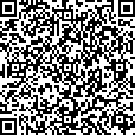

# 演奏作品

- ::: tip 电脑 pc 端
  建议使用谷歌 chrome 浏览器打开此网站
  :::

- ::: danger 手机、移动设备
  注意：如果使用手机微信，强烈建议复制地址后用浏览器（推荐使用谷歌 chrome 浏览器），或跳转到手机浏览器打开此网站，否则部分页面空白、视频、图片无法正常加载显示。
  :::

## 作品一

- 分享一个来自 Angeline Bell 在《My Quirky Notebook》中发表的一首很有意思的爵士小曲，《Squeezy the Squirrel》。
- 由于涉及版权，此处不展示乐谱，您可以从[此网站](https://www.musica-ferrum.com/books/my-quirky-notebook-studio-license/)预览和购买此乐谱。（注意：该曲谱网为海外网站，直接访问可能出现延迟甚至无法访问的情况。）
- 演奏时间：2024-11-19

### 视频

- 方式一：

  

    <iframe src="//player.bilibili.com/player.html?isOutside=true&aid=113510398952075&bvid=BV1NXSFYGEmY&cid=26845515655&p=1&autoplay=0" 
    frameborder="no" 
    allowfullscreen="true" 
    style="position: absolute; top: 0; left: 0; width: 100%; height: 100%;">
    </iframe>
  

- 方式二：
  [视频链接](https://www.bilibili.com/video/BV1NXSFYGEmY/?share_source=copy_web&vd_source=e07067a58054dd2f2f1a205695fefaf5)

- 方式三：手机扫码查看
  
